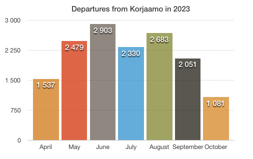

This project studies Helsinki City bike data with R and Python. The scripts include functions which calculate the most used bike stations, the most frequent trip between two stations and the longest trips made by bike users. You can also see how the code is executed in the .ipynb file. The source data is freely accesible and can be found from HSL.fi. The data for the statistical image is obtained from the R script and it shows monthly departures from Korjaamo bike station in 2023.

