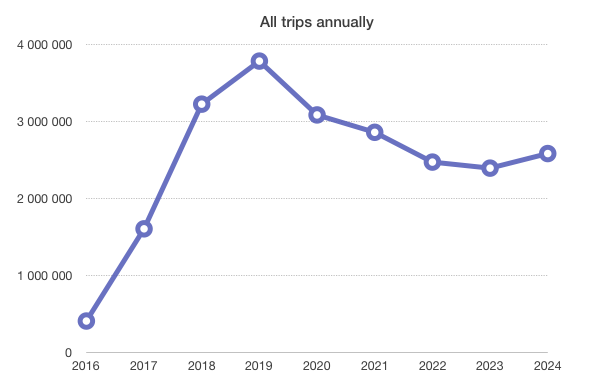
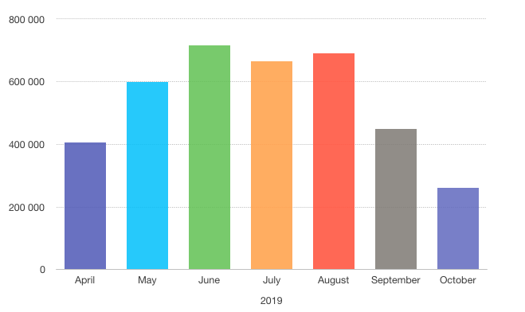
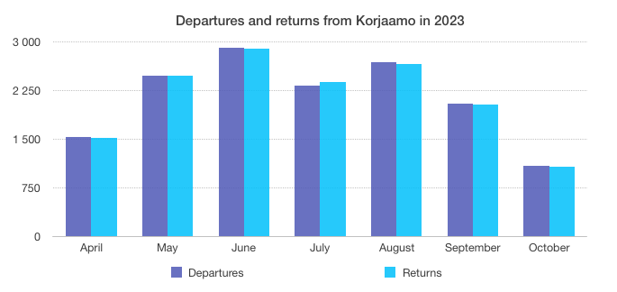

This project studies Helsinki City Bikes data with R and Python. Two similar scripts include functions which calculate the most used bike stations, the most frequent trip between two stations and the longest trips made by bike users. You can also see how the code is executed in the .ipynb file. The source data is freely accesible and can be found from HSL.fi. Below are shown few figures that are obtained from the scripts.
 

Figure 1. All trips by year since the establishment of the current city bike system.

 

Figure 2. All trips by month in peak year 2019.

 

Figure 3. Departures and returns by month from Korjaamo bike station in season 2023.

 
Learn more about Helsinki City Bikes here: https://www.hsl.fi/en/citybikes
