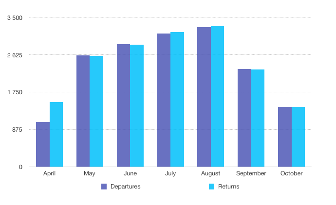

This project studies Helsinki City Bikes data with R and Python. Two similar scripts include functions which calculate the most used bike stations, the most frequent trip between two stations and the longest trips made by bike users. You can also see how the code is executed in the .ipynb file. The source data is freely accesible and can be found from HSL.fi. Below is shown a figure that is obtained from the scripts, and it shows monthly departures from Korjaamo bike station in season 2023. According to the figure, the station is used the most in June and the number of departures and returns is almost the same each month.

Learn more about city bikes here: https://www.hsl.fi/en/citybikes
